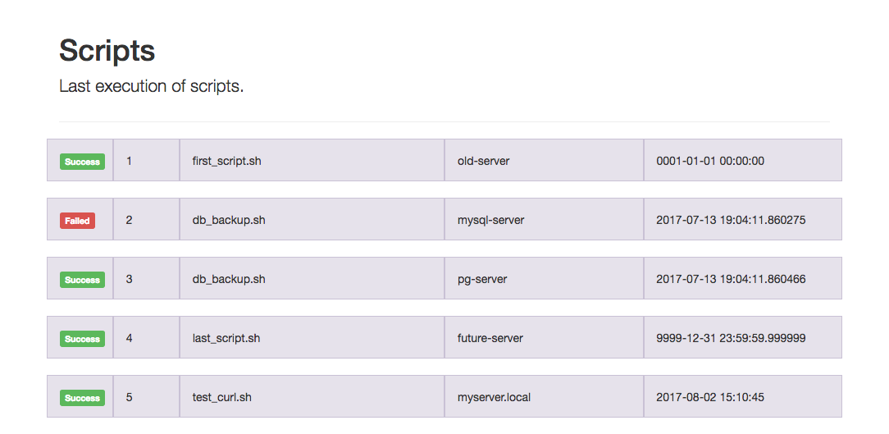

# Scripto

Simple python app to monitor automatic script execution.  
The idea is to have a simple dashboard on which all the scripts you run in your datacenter are represented with their execution status.



## Install & run
This server is written in python 3.  
Use pip to install the dependencies of the project, then run the server :
```
pip install -r pip-packages.txt
```

Run the server :

```
python scripto.py
```

## REST API
You can use the REST api of the server to send the status of your scripts.

The main endpoint is `/api/v1/script`

### Data format
The json format is self explanatory :
```
{
  "id": unique integer, returned by server upon creation,
  "last_exec": "timestamp YYYY-MM-DDTHH:mm:ss",
  "name": "string : the script name",
  "server": "string : the server name",
  "status": boolean
}
```

For the date you can use the special strings "CURRENT_TIMESTAMP", "CURRENT_DATE", or "LOCALTIMESTAMP".

example :
```json
POST /api/v1/script HTTP/1.1
Host: example.com

{
  "last_exec": "CURRENT_TIMESTAMP",
  "name": "test.sh",
  "server": "myserver.local",
  "status": true
}
```
Response :
```json
HTTP/1.0 201 CREATED

{
  "id": 1,
  "last_exec": "2017-08-02T14:16:25",
  "name": "test.sh",
  "server": "myserver.local",
  "status": true
}
```


### Curl examples
You need to specify the json content type in your HTTP Headers for the server to accept your data.

#### Creation, use POST
Run :
```bash
$ curl -i -H "Content-Type: application/json" -XPOST http://localhost:5000/api/v1/script -d '{"last_exec":"CURRENT_TIMESTAMP", "name": "test_curl.sh", "server": "'$HOST'", "status": 0}'
```

to get the response

```json
HTTP/1.0 201 CREATED
Content-Type: application/json
Location: http://localhost:5000/api/v1/script/5
Vary: Accept
Content-Type: application/json
Content-Length: 140
Server: Werkzeug/0.12.2 Python/3.6.1
Date: Wed, 02 Aug 2017 14:16:25 GMT

{
  "id": 5,
  "last_exec": "2017-08-02T14:16:25",
  "name": "test_curl.sh",
  "server": "myserver.local",
  "status": false
}
```

#### Update, get the id previously returned and use PUT

```
$  curl -i -H "Content-Type: application/json" -XPUT http://localhost:5000/api/v1/script/5 -d '{"last_exec":"CURRENT_TIMESTAMP", "name": "test_curl.sh", "server": "'$HOST'", "status": 1}'
```

Response :

```json
HTTP/1.0 200 OK
Content-Type: application/json
Vary: Accept
Content-Type: application/json
Content-Length: 130
Server: Werkzeug/0.12.2 Python/3.6.1
Date: Wed, 02 Aug 2017 15:10:45 GMT

{
  "id": 5,
  "last_exec": "2017-08-02T15:10:45",
  "name": "test_curl.sh",
  "server": "myserver.local",
  "status": true
}
```

#### DELETE
```bash
$ curl -i -H "Content-Type: application/json" -XDELETE http://localhost:5000/api/v1/script/5
```

Response :
```
HTTP/1.0 204 NO CONTENT
Content-Type: application/json
Vary: Accept
Content-Type: application/json
Content-Length: 0
Server: Werkzeug/0.12.2 Python/3.6.1
Date: Wed, 02 Aug 2017 15:09:50 GMT
```
